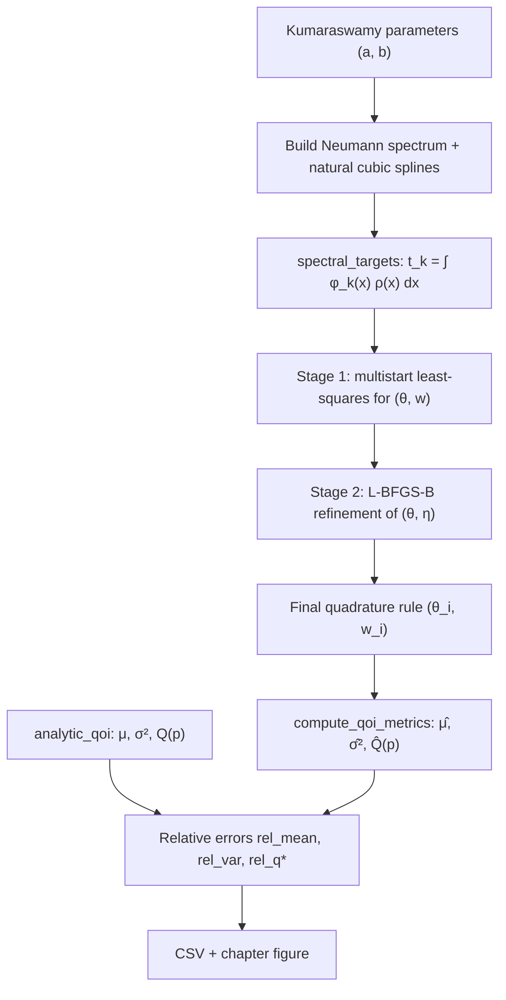

# Mathematical Formulation and Code Mapping

**Reference chapter:** *A Spectral Quadrature for Computing Moments and Quantiles of Continuous Probability Distributions*  
**Repository:** Kumaraswamy Spectral Quadrature — Article Baseline (`KSQ_V1_Multiobjective`)  
**Solver version:** frozen public baseline (Stage 1: `MS_V1_REFERENCE`; Stage 2: multi-objective refinement)

---

## 1. Purpose

This document establishes a rigorous correspondence between:

1. the **mathematical formulation** presented in the submitted chapter on spectral quadrature for continuous probability distributions; and  
2. the **computational implementation** contained in this repository.

Its goal is to let a mathematician, statistician, or programmer read the code without ambiguity: the principal mathematical objects implemented in this public baseline—including the Kumaraswamy density, the spectral moment system, the quadrature rule, and the post-processed statistical quantities of interest—have an explicit Python realization traceable through this document.

The chapter studies a Kumaraswamy distribution on \([0,1]\) as the running example. The public baseline implements that case exactly and reports relative errors for the mean, variance, and quantiles (especially the median \(Q_{0.50}\)).

**Scope of this mapping document**

- Covers the **official chapter campaign** (`campaign/run_chapter_campaign.py`) and the modules it calls.  
- Does **not** describe the private research repository or exploratory solvers outside this package.  
- Where chapter notation and code identifiers differ, the difference is stated explicitly (see Section 2).

---

## 2. Notation correspondence

The chapter uses standard probabilistic notation. The code uses descriptive function names. The table below is the authoritative mapping for this repository.

| Mathematical concept | Chapter notation (typical) | Code symbol / function | File |
| -------------------- | ------------------------ | ---------------------- | ---- |
| Probability density | \(\rho(x;\alpha,\beta)\) | `pdf(x, case)` (`case.a` \(\equiv\alpha\), `case.b` \(\equiv\beta\)) | `shared/kumaraswamy.py` |
| Cumulative distribution function (CDF) | \(P(x)\) | `cdf(x, case)` | `shared/kumaraswamy.py` |
| Quantile function | \(Q(p)=P^{-1}(p)\) | `quantile(p, case)` | `shared/kumaraswamy.py` |
| Raw moment | \(m_r=\mathbb{E}[X^r]\) | `raw_moment(r, case)` | `shared/kumaraswamy.py` |
| Mean (analytic) | \(\mu=m_1\) | `analytic_qoi(case).mean` | `shared/analytic_qoi.py` |
| Variance (analytic) | \(\sigma^2=m_2-\mu^2\) | `analytic_qoi(case).variance` | `shared/analytic_qoi.py` |
| Quadrature nodes | \(\theta_1,\ldots,\theta_N\) | `nodes` / `theta` arrays | Stage 1 & 2 results |
| Quadrature weights | \(w_1,\ldots,w_N\) | `weights` arrays | Stage 1 & 2 results |
| Total weight / normalization | \(Z=\sum_i w_i\) | `z_ref`, `z_hat = sum(w)` | `setup_spectral_bundle`, `qoi_metrics` |
| Mean from quadrature rule | \(\hat\mu\) | `moments_from_rule()` → `mu` | `shared/qoi_metrics.py` |
| Variance from quadrature rule | \(\hat\sigma^2\) | `moments_from_rule()` → `var` | `shared/qoi_metrics.py` |
| Discrete CDF from rule | \(\hat P(x)\) | `cdf_from_rule(x, nodes, weights)` | `shared/qoi_metrics.py` |
| Discrete quantile from rule | \(\hat Q(p)\) | `quantile_from_rule(p, nodes, weights)` | `shared/qoi_metrics.py` |
| Spectral eigenfunctions | \(\phi_k(x)\) | cubic splines of discrete Neumann modes | `shared/spectral_neumann.py` |
| Spectral targets | \(t_k=\int \phi_k(x)\rho(x)\,dx\) | `spectral_targets(case, vecs, dx)` | `shared/spectral_neumann.py` |
| Interpolation matrix | \(G_{k,j}=\phi_k(\theta_j)\) | `phi_matrix(nodes, vecs, dx)` | `shared/spectral_neumann.py` |
| Spectral moment residual vector | \(F(x,w)\) (Algorithm 1) | `spectral_moment_residuals(...)` | `shared/spectral_neumann.py` |
| Relative spectral error | \(E_r\) | `terms["E_r"]` in Stage 2 | `KSQ_V1_Multiobjective/objective.py` |
| Relative mean error | \(E_{\mathrm{mean}}\) | `metrics["rel_mean"]` | `shared/qoi_metrics.py` |
| Relative variance error | \(E_{\mathrm{var}}\) | `metrics["rel_var"]` | `shared/qoi_metrics.py` |
| Mean relative quantile error | \(E_{\mathrm{quant}}\) | `metrics["rel_quant_mean"]` | `shared/qoi_metrics.py` |
| Scalarized Stage-2 objective (implementation extension; not in chapter Algorithm 1) | — | `compute_multiobjective_F()` → `score_F` | `KSQ_V1_Multiobjective/objective.py` |

### Critical naming distinction

- **\(P(x)\)** in the chapter denotes the **CDF** of the random variable (Subsection 3.1). In code this is `cdf()`, not `compute_multiobjective_F()`.
- **\(F(x,w)\)** in the chapter (Algorithm 1) denotes the **nonlinear spectral moment residual** assembled during quadrature construction. Stage 1 seeks \((x^\*,w^\*)\) minimizing \(\|F(x,w)\|_2^2\). In code, the residual vector is `spectral_moment_residuals(...)`; Stage 1 least squares implements this construction.
- **`compute_multiobjective_F()`** is the **scalarized Stage-2 objective** used in this frozen baseline implementation. It is **not** denoted by \(F(x,w)\) in the chapter manuscript and must not be confused with either \(P(x)\) or the spectral residual \(F(x,w)\).
- The code comment in `phi_matrix` uses `G` for the matrix with entries \(\phi_k(\theta_j)\); the chapter uses \(\phi_k\) (eigenfunctions) and node notation \(x_i\) in equation (1), implemented as `nodes` / \(\theta_i\) in this repository.

### Distribution parameters in this baseline

| Case label | \(a\) | \(b\) | `case_id` |
| ---------- | ----- | ----- | --------- |
| Kum(2,8) | 2.0 | 8.0 | `case_1` |
| Kum(2,2.41) | 2.0 | 2.41 | `case_2` |
| Kum(4,1.5) | 4.0 | 1.5 | `case_3` |

Defined in `shared/cases.py` as `KUMARASWAMY_CASES`.

---

## 3. General workflow

The end-to-end pipeline from distribution specification to reported errors:



**Official entry point:** `campaign/run_chapter_campaign.py`  
**Frozen parameters:** `campaign/chapter_campaign_config.py` (`nx=801`, `N=4,\ldots,14`)

---

## 4. Mathematical formulation and implementation

### 4.1 Kumaraswamy density and analytic reference quantities

On \((0,1)\), the Kumaraswamy density with parameters \((\alpha,\beta)\) is

\[
\rho(x;\alpha,\beta)=\alpha\beta\,x^{\alpha-1}\bigl(1-x^{\alpha}\bigr)^{\beta-1}.
\]

In this repository, `case.a` and `case.b` store \((\alpha,\beta)\).

**Implementation:**

```python
def pdf(x, case: KumaraswamyCase) -> float | np.ndarray:
    """PDF Kumaraswamy: f(x;a,b) = a*b*x^(a-1)*(1-x^a)^(b-1) em (0,1)."""
```

**File:** `shared/kumaraswamy.py`

The analytic CDF is

\[
P(x;\alpha,\beta)=1-\bigl(1-x^{\alpha}\bigr)^{\beta},
\]

implemented as `cdf(x, case)`.

Raw moments are

\[
m_r = \mathbb{E}[X^r] = \beta\,B\!\left(1+\frac{r}{\alpha},\,\beta\right),
\]

implemented as `raw_moment(r, case)` using `scipy.special.beta`.

The analytic QoI bundle is assembled in `analytic_qoi(case)`:

```python
mu = raw_moment(1, case)
m2 = raw_moment(2, case)
var = float(m2 - mu * mu)
qmap = {_quant_key(p): quantile(p, case) for p in levels}
```

**File:** `shared/analytic_qoi.py`

---

### 4.2 Mean

#### Mathematical definition

\[
\mu = \mathbb{E}[X] = \int_0^1 x\,\rho(x)\,dx = m_1.
\]

#### Reference value in code

\[
\mu_{\mathrm{ref}} = m_1 = \texttt{raw\_moment(1, case)}.
\]

#### Approximate value from the quadrature rule

Given nodes \(\theta_i\) and weights \(w_i\), define the total mass

\[
\hat Z = \sum_{i=1}^{N} w_i.
\]

The code estimates the mean by the **normalized first moment of the discrete rule**:

\[
\hat\mu = \frac{1}{\hat Z}\sum_{i=1}^{N} w_i\,\theta_i.
\]

#### Implementation

```python
def moments_from_rule(nodes: np.ndarray, weights: np.ndarray) -> tuple[float, float]:
    th = np.asarray(nodes, dtype=float).ravel()
    w = np.asarray(weights, dtype=float).ravel()
    z_hat = float(np.sum(w))
    mu = float(np.dot(w, th) / z_hat)
    m2 = float(np.dot(w, th * th) / z_hat)
    var = max(float(m2 - mu * mu), 0.0)
    return mu, var
```

**Function:** `moments_from_rule` in `shared/qoi_metrics.py`

#### Interpretation

- The mean reported in the chapter campaign is **not** obtained by integrating \(\rho\) at evaluation time.  
- It is the first moment of the **final discrete rule** produced by Stage 2.  
- Stage 1 enforces spectral moment conditions; Stage 2 may adjust \((\theta,w)\) to reduce QoI errors while penalizing spectral residual.

---

### 4.3 Variance

#### Mathematical definition

\[
\sigma^2 = \mathrm{Var}(X) = \mathbb{E}[X^2]-\mathbb{E}[X]^2 = m_2-\mu^2.
\]

#### Reference value

\[
\sigma^2_{\mathrm{ref}} = m_2 - \mu^2,\quad m_2=\texttt{raw\_moment(2, case)}.
\]

#### Approximate value from the quadrature rule

\[
\widehat{m_2} = \frac{1}{\hat Z}\sum_{i=1}^{N} w_i\,\theta_i^2,\qquad
\hat\sigma^2 = \max\bigl(\widehat{m_2}-\hat\mu^2,\,0\bigr).
\]

The `max(..., 0)` guard prevents negative variance due to floating-point error.

#### Implementation

Same function `moments_from_rule` (see Section 4.2).

#### Relative error

\[
\texttt{rel\_var} = \frac{|\hat\sigma^2-\sigma^2_{\mathrm{ref}}|}{\max(|\sigma^2_{\mathrm{ref}}|,\varepsilon)}.
\]

---

### 4.4 Quantiles

This section is central to the chapter and to the advisor’s question: **how does the code compute quantiles?**

#### 4.4.1 Theoretical definition (continuous distribution)

For \(p\in(0,1)\), the quantile \(q_p\) satisfies

\[
P(q_p)=p,
\qquad\text{equivalently}\qquad
Q(p)=P^{-1}(p).
\]

For the Kumaraswamy distribution, the closed form implemented in the code is

\[
Q(p;\alpha,\beta)=\Bigl[1-(1-p)^{1/\beta}\Bigr]^{1/\alpha}.
\]

```python
def quantile(p: float, case: KumaraswamyCase) -> float:
    """Quantil analitico: Q(p;a,b) = [1 - (1-p)^(1/b)]^(1/a)."""
```

**File:** `shared/kumaraswamy.py`  
**Levels used in the chapter baseline:** \(p\in\{0.25,\,0.50,\,0.75\}\) (`QUANTILE_LEVELS` in `shared/cases.py`).

The median reported as \(Q_{0.50}\) in the README and chapter figure corresponds to `rel_q50`, i.e. \(p=0.50\).

**Construction versus evaluation.** Generalized spectral quadrature, as presented in the chapter (Algorithm 1), does **not** approximate quantiles directly. It first constructs a quadrature rule \(\{x_i,w_i\}_{i=1}^N\) (implemented as \(\{\theta_i,w_i\}\)) by fitting spectral moment information. Only **after** this rule is available are quantile estimates obtained: a discrete CDF \(\hat P\) is induced by the rule, and approximate quantiles follow as the generalized inverse of \(\hat P\), as detailed below.

#### 4.4.2 Approximate quantile from the quadrature rule

The solver produces a **discrete** distribution supported on the nodes \(\{\theta_i\}\) with probabilities proportional to \(\{w_i\}\). Its CDF is a step function:

\[
\hat P(x)=\frac{1}{\hat Z}\sum_{i:\,\theta_i\le x} w_i.
\]

**Implementation of \(\hat P(x)\):**

```python
def cdf_from_rule(a: float, nodes: np.ndarray, weights: np.ndarray) -> float:
    ...
    return float(np.sum(w[th <= float(a)])) / z_hat
```

**File:** `shared/qoi_metrics.py`

#### 4.4.3 Inversion algorithm — discrete generalized inverse

The approximate quantile \(\hat Q(p)\) is **not** computed by solving \(P(q)=p\) with Newton, bisection, or any root-finding method on the continuous Kumaraswamy CDF.

Instead, the code computes the **left-continuous generalized inverse** of the discrete CDF \(\hat P\):

\[
\hat Q(p)=\inf\{x\in[0,1]:\hat P(x)\ge p\}.
\]

**Algorithm (exactly as implemented):**

1. Sort nodes: \(\theta_{(1)}\le\cdots\le\theta_{(N)}\) with weights \(w_{(i)}\).
2. Cumulative weights: \(C_j=\sum_{i=1}^{j} w_{(i)}\).
3. Target mass: \(t = p\,\hat Z\).
4. Index: \(j^\*=\min\{j: C_j\ge t\}\) via `np.searchsorted(cw, target, side="left")`.
5. Return: \(\hat Q(p)=\theta_{(j^\*)}\).

**Full implementation:**

```python
def quantile_from_rule(rho: float, nodes: np.ndarray, weights: np.ndarray) -> float:
    if not (0.0 < rho < 1.0):
        raise ValueError("rho deve pertencer a (0,1).")
    th = np.asarray(nodes, dtype=float).ravel()
    w = np.asarray(weights, dtype=float).ravel()
    order = np.argsort(th)
    th = th[order]
    w = w[order]
    cw = np.cumsum(w)
    z_hat = float(cw[-1])
    target = float(rho) * z_hat
    idx = int(np.searchsorted(cw, target, side="left"))
    idx = min(max(idx, 0), len(th) - 1)
    return float(th[idx])
```

**File:** `shared/qoi_metrics.py`

#### 4.4.4 What the implementation does **not** do

| Method | Used? |
| ------ | ----- |
| Newton / bisection on continuous \(P(x)\) | **No** |
| Interpolation between consecutive nodes | **No** |
| `scipy.optimize` root finding for quantiles | **No** |
| Direct enforcement of \(P(q_p)=p\) in Stage 1 or Stage 2 | **No** |

The approximate quantile is **always one of the quadrature nodes** \(\theta_i\).

#### 4.4.5 Relation to optimization (Stage 2)

Quantiles enter Stage 2 only through **post-evaluation** of the rule:

\[
E_{\mathrm{quant}}=\frac{1}{|\mathcal{P}|}\sum_{p\in\mathcal{P}}
\frac{|\hat Q(p)-Q(p)|}{\max(|Q(p)|,\varepsilon)},
\quad \mathcal{P}=\{0.25,0.50,0.75\},
\]

stored as `metrics["rel_quant_mean"]` and weighted by `LAMBDA_Q` in `compute_multiobjective_F`.

Thus Stage 2 **refines** \((\theta,w)\) to reduce quantile error of the resulting discrete rule; it does **not** solve \(P(q)=p\) analytically or numerically for the continuous distribution.

#### 4.4.6 Evaluation loop in `compute_qoi_metrics`

```python
for p in quantile_levels:
    key = f"q{int(round(100 * p))}"
    q_ref = ref.quantiles[key]
    q_hat = quantile_from_rule(p, nodes, weights)
    out[f"abs_{key}"] = abs(q_hat - q_ref)
    out[f"rel_{key}"] = _rel(q_hat, q_ref)
```

---

## 5. Relative errors

### 5.1 Absolute error

For a generic QoI with reference value \(v_{\mathrm{ref}}\) and estimate \(\hat v\):

\[
e_{\mathrm{abs}} = |\hat v - v_{\mathrm{ref}}|.
\]

Implemented as `abs_q25`, `abs_q50`, `abs_q75`, etc.

### 5.2 Relative error

\[
e_{\mathrm{rel}} = \frac{|\hat v - v_{\mathrm{ref}}|}{\max(|v_{\mathrm{ref}}|,\varepsilon)},
\qquad \varepsilon = 10^{-30}.
\]

```python
EPS = 1e-30

def _rel(a: float, b: float) -> float:
    return abs(float(a) - float(b)) / max(abs(float(b)), EPS)
```

**File:** `shared/qoi_metrics.py`

### 5.3 Motivation for \(\varepsilon\)

When \(|v_{\mathrm{ref}}|\) is extremely small (or zero in the limit), division would be unstable. Clamping the denominator with \(\varepsilon\) prevents division by zero while leaving relative errors unchanged for typical reference magnitudes in the Kumaraswamy cases.

### 5.4 Chapter-reported metrics

| Metric key | Meaning |
| ---------- | ------- |
| `rel_mean` | relative error of \(\hat\mu\) |
| `rel_var` | relative error of \(\hat\sigma^2\) |
| `rel_q25`, `rel_q50`, `rel_q75` | relative quantile errors at \(p=0.25,0.50,0.75\) |
| `rel_quant_mean` | mean of the three relative quantile errors (Stage 2 objective) |

The official chapter figure (`figures/make_relative_errors_kumaraswamy.py`) plots **`rel_mean`**, **`rel_var`**, and **`rel_q50`** (labeled \(Q_{0.50}\)) versus \(N\).

Additional diagnostics in the CSV but not in the main figure: `CDF_sup`, `W1` (sup-norm and \(L^1\) distance between \(\hat P\) and \(P\) on a uniform grid of 2000 points).

---

## 6. Stage 1 — spectral quadrature construction

Stage 1 finds an initial rule \((\theta,w)\) satisfying the **spectral moment system** approximately.

### 6.1 Spectral basis

1. Discretize a 1D Neumann problem on \([0,1]\) with mesh size `nx` (campaign: **801**).  
2. Eigenvectors \(\phi_k\) are normalized in discrete \(L^2\) and interpolated by **natural cubic splines** (`CubicSpline`, `bc_type="natural"`).

**Functions:** `build_neumann_spectrum`, `_natural_splines`, `phi_matrix` — `shared/spectral_neumann.py`

### 6.2 Spectral targets

For modes \(k=0,\ldots,m-1\) with \(m=2N\):

\[
t_k = \int_0^1 \phi_k(x)\,\rho(x;\alpha,\beta)\,dx,\qquad t_0=1.
\]

Mode \(k=0\) is constant; \(t_0=1\) encodes normalization of the density. Higher targets are computed by adaptive quadrature (`scipy.integrate.quad`) on \(\phi_k(x)\rho(x)\).

**Function:** `spectral_targets(case, vecs, dx)`

### 6.3 Discrete spectral moment equations

Let \(G_{k,j}=\phi_k(\theta_j)\). The ideal continuous rule would satisfy

\[
\sum_{j=1}^{N} w_j\,G_{k,j} = t_k,\qquad k=0,\ldots,m-1.
\]

**Residual vector (chapter notation \(F(x,w)\)):**

\[
F_k(x,w)=\sum_{j=1}^{N} w_j\,G_{k,j} - t_k.
\]

**Function:** `spectral_moment_residuals` returns `G @ w - t`.

### 6.4 Stage 1 optimization

Stage 1 solves a constrained least-squares problem with unknowns \((\theta, p)\) where \(w_j=p_j^2\ge 0\), implementing the chapter construction

\[
(x^\*,w^\*)=\arg\min_{x,w}\|F(x,w)\|_2^2
\]

(Algorithm 1, Step 6):

- Residuals: normalized spectral equations plus a soft penalty on \(\sum w_j \approx Z_{\mathrm{ref}}\).  
- Solver: `scipy.optimize.least_squares` with bounds \(\theta_j\in[0,1]\).  
- **Multistart:** `MS_V1_REFERENCE` evaluates many initial strategies; the candidate with smallest \(\|r\|_2\) is selected.

**Functions:** `stage1_solve_with_strategy`, `stage1_solve` — `KSQ_V1_Multiobjective/optimization_stage1.py`

**Output:** `Stage1Result` with `nodes`, `weights`, `residual_l2`.

Stage 1 **constructs** the quadrature rule from the spectral formulation. It does not run the Stage-2 scalarized objective (`compute_multiobjective_F`).

---

## 7. Stage 2 — multi-objective refinement

Stage 2 **does not rebuild** the spectral system from scratch. It **refines** the Stage 1 solution.

### 7.1 Decision variables

- Nodes \(\theta\in[0,1]^N\) (clipped).  
- Unconstrained parameters \(\eta\) defining weights via softmax-type map:

```python
def weights_from_eta(eta: np.ndarray, z_ref: float) -> np.ndarray:
    e = np.asarray(eta, dtype=float).ravel()
    ex = np.exp(e - np.max(e))
    w = ex / max(float(np.sum(ex)), EPS)
    return w * float(z_ref)
```

**File:** `KSQ_V1_Multiobjective/objective.py`

This enforces \(w_i>0\) and \(\sum_i w_i = Z_{\mathrm{ref}}=1\) in the campaign.

### 7.2 Objective terms

\[
E_r = \frac{\|Gw-t\|_2}{\|t\|_2},
\]

\[
E_{\mathrm{mean}}=\texttt{rel\_mean},\quad
E_{\mathrm{var}}=\texttt{rel\_var},\quad
E_{\mathrm{quant}}=\texttt{rel\_quant\_mean}.
\]

**Function:** `compute_objective_terms` calls `compute_qoi_metrics`.

### 7.3 Multi-objective scalarization (implementation extension)

This frozen baseline applies a Stage-2 refinement not spelled out in chapter Algorithm 1. The scalarized objective minimized by `stage2_multiobjective_refine` is

\[
J_{\mathrm{MO}}=\lambda_r E_r+\lambda_m E_{\mathrm{mean}}+\lambda_v E_{\mathrm{var}}+\lambda_q E_{\mathrm{quant}}.
\]

Default weights (`shared/cases.py`): \(\lambda_r=1\), \(\lambda_m=\lambda_v=\lambda_q=10\).

```python
def compute_multiobjective_F(terms, *, lambda_r, lambda_m, lambda_v, lambda_q) -> float:
    return (
        float(lambda_r) * terms["E_r"]
        + float(lambda_m) * terms["E_mean"]
        + float(lambda_v) * terms["E_var"]
        + float(lambda_q) * terms["E_quant"]
    )
```

**Function:** `stage2_multiobjective_refine` minimizes \(J_{\mathrm{MO}}\) (via `compute_multiobjective_F`) with `L-BFGS-B`.  
**File:** `KSQ_V1_Multiobjective/optimization_stage2.py`

### 7.4 Output used for chapter QoIs

Campaign metrics are computed from **`stage2.nodes`** and **`stage2.weights`**, not Stage 1:

```python
metrics = compute_qoi_metrics(case, stage2.nodes, stage2.weights, ref, quantile_levels=QUANTILE_LEVELS)
```

**File:** `campaign/run_chapter_campaign.py`

---

## 8. Complete mathematical-to-code mapping

| # | Mathematical object / equation | Python function | File | Description |
| - | ------------------------------ | --------------- | ---- | ----------- |
| 1 | \(\rho(x;\alpha,\beta)=\alpha\beta\,x^{\alpha-1}(1-x^{\alpha})^{\beta-1}\) | `pdf` | `shared/kumaraswamy.py` | Kumaraswamy density |
| 2 | \(P(x)=1-(1-x^{\alpha})^{\beta}\) | `cdf` | `shared/kumaraswamy.py` | Analytic CDF |
| 3 | \(Q(p)=[1-(1-p)^{1/\beta}]^{1/\alpha}\) | `quantile` | `shared/kumaraswamy.py` | Analytic quantile |
| 4 | \(m_r=\beta\,B(1+r/\alpha,\beta)\) | `raw_moment` | `shared/kumaraswamy.py` | Raw moments |
| 5 | \(\mu=m_1\), \(\sigma^2=m_2-\mu^2\), \(\{Q(p)\}\) | `analytic_qoi` | `shared/analytic_qoi.py` | Reference QoI bundle |
| 6 | Neumann eigenproblem on \([0,1]\) | `build_neumann_spectrum` | `shared/spectral_neumann.py` | Spectral mesh |
| 7 | Spline interpolation \(\phi_k(x)\) | `_natural_splines`, `phi_matrix` | `shared/spectral_neumann.py` | Evaluate modes at nodes |
| 8 | \(t_k=\int \phi_k \rho\,dx\) | `spectral_targets` | `shared/spectral_neumann.py` | Spectral right-hand side |
| 9 | \(F(x,w)=Gw-t\) (Algorithm 1) | `spectral_moment_residuals` | `shared/spectral_neumann.py` | Spectral residual |
| 10 | \(\hat\mu=\sum w_i\theta_i/\hat Z\) | `moments_from_rule` | `shared/qoi_metrics.py` | Estimated mean |
| 11 | \(\hat\sigma^2=\max(\widehat{m_2}-\hat\mu^2,0)\) | `moments_from_rule` | `shared/qoi_metrics.py` | Estimated variance |
| 12 | \(\hat P(x)=\sum_{i:\theta_i\le x}w_i/\hat Z\) | `cdf_from_rule` | `shared/qoi_metrics.py` | Discrete CDF |
| 13 | \(\hat Q(p)=\theta_{(j^\*)}\) from cumsum | `quantile_from_rule` | `shared/qoi_metrics.py` | Discrete quantile |
| 14 | \(e_{\mathrm{rel}}=|a-b|/\max(|b|,\varepsilon)\) | `_rel` | `shared/qoi_metrics.py` | Relative error |
| 15 | All QoI errors in one call | `compute_qoi_metrics` | `shared/qoi_metrics.py` | Campaign evaluation |
| 16 | Stage 1 least squares | `stage1_solve` | `KSQ_V1_Multiobjective/optimization_stage1.py` | Initial rule |
| 17 | \(E_r,E_{\mathrm{mean}},E_{\mathrm{var}},E_{\mathrm{quant}}\) | `compute_objective_terms` | `KSQ_V1_Multiobjective/objective.py` | Objective terms |
| 18 | \(J_{\mathrm{MO}}=\sum \lambda_\bullet E_\bullet\) (implementation) | `compute_multiobjective_F` | `KSQ_V1_Multiobjective/objective.py` | Stage-2 scalarized objective |
| 19 | Stage 2 refinement | `stage2_multiobjective_refine` | `KSQ_V1_Multiobjective/optimization_stage2.py` | Final rule |
| 20 | Chapter batch run | `run_one`, `cli_main` | `campaign/run_chapter_campaign.py` | CSV generation |
| 21 | Chapter figure | `main` (script) | `figures/make_relative_errors_kumaraswamy.py` | Error vs \(N\) plot |

---

## 9. Important implementation notes

### 9.1 Discrete step-function CDF

\(\hat P(x)\) is piecewise constant with jumps at the nodes. It is consistent with `quantile_from_rule` but differs from the smooth analytic \(P(x)\).

### 9.2 Quantiles coincide with nodes

\(\hat Q(p)\in\{\theta_1,\ldots,\theta_N\}\) always. There is no sub-node interpolation.

### 9.3 No continuous root-finding for approximate quantiles

The implementation never solves \(P(q)=p\) numerically for \(\hat Q\). Only the analytic reference uses the closed-form inverse.

### 9.4 Weight normalization

- Campaign sets `z_ref = 1.0` in `setup_spectral_bundle`.  
- Stage 2 maps \(\eta\mapsto w\) so \(\sum_i w_i = z_{\mathrm{ref}}\).  
- `moments_from_rule` still divides by \(\hat Z=\sum w_i\) for robustness.

### 9.5 Role of \(Z\) and \(\hat Z\)

- \(Z_{\mathrm{ref}}\): target total weight in optimization.  
- \(\hat Z\): actual sum of weights when evaluating QoIs.  
- In the frozen campaign they coincide at 1 after Stage 2, but the code path supports general positive \(\hat Z\).

### 9.6 Stage 1 vs Stage 2

| Aspect | Stage 1 | Stage 2 |
| ------ | ------- | ------- |
| Purpose | Fit spectral moments | Reduce \(J_{\mathrm{MO}}\) |
| Method | Multistart least squares | L-BFGS-B |
| QoI errors | Not in objective | In objective via `compute_qoi_metrics` |
| Output used in CSV | No (only Stage 2) | Yes |

### 9.7 Spectral mesh default vs campaign

`DEFAULT_NX_SPECTRUM=401` in `spectral_neumann.py`; the **chapter campaign explicitly passes `nx_spectrum=801`**. Documentation and reproduction must use 801 for chapter parity.

### 9.8 Documented divergences / limitations

1. **Quantile objective vs spectral constraints:** Stage 2 improves quantile fit of the discrete rule but does not guarantee \( \hat P(q_p)=p \) exactly.  
2. **Chapter figure vs CSV:** figure uses three metrics; CSV stores **eight** QoI error columns (`rel_mean`, `rel_var`, `rel_q25`, `rel_q50`, `rel_q75`, `abs_q25`, `abs_q50`, `abs_q75`) plus additional diagnostics (`CDF_sup`, `W1`, `residual_l2`, `F`, etc.).  
3. **Code comments in Portuguese:** function docstrings use Portuguese; this mapping document uses English for international readers. Mathematical content is identical.  
4. **Chapter LaTeX source not in repo:** this mapping is derived from the submitted chapter title and the frozen code. If the chapter uses additional normalizing constants for \(\phi_k\), they are exactly those implemented in `spectral_neumann.py` (discrete \(L^2\) normalization and \(t_0=1\)).

---

## 10. Repository structure (files used to build this document)

### Core mathematical model

- `shared/kumaraswamy.py` — \(\rho\), \(P\), \(Q\), \(m_r\)  
- `shared/analytic_qoi.py` — analytic QoI assembly  
- `shared/cases.py` — cases, `QUANTILE_LEVELS`, objective weights  
- `shared/qoi_metrics.py` — discrete QoIs and errors  

### Spectral construction

- `shared/spectral_neumann.py` — Neumann spectrum, splines, targets, residuals  

### Solver

- `KSQ_V1_Multiobjective/optimization_stage1.py` — Stage 1  
- `KSQ_V1_Multiobjective/optimization_stage2.py` — Stage 2  
- `KSQ_V1_Multiobjective/objective.py` — objective terms and Stage-2 scalarized objective (`compute_multiobjective_F`)  
- `KSQ_V1_Multiobjective/multistart.py` — multistart orchestration (called by Stage 1)  
- `shared/multistart_configs/ms_v1_reference.py` — frozen Stage 1 config  

### Campaign and outputs

- `campaign/run_chapter_campaign.py` — official entry point  
- `campaign/chapter_campaign_config.py` — frozen `nx`, `N` range  
- `outputs/csv/chapter_campaign_multi_results.csv` — reference results  
- `figures/make_relative_errors_kumaraswamy.py` — chapter figure  

### Documentation cross-check

- `README.md` — scientific scope  
- `REPRODUCIBILITY.md` — reproduction parameters  
- `docs/auditorias/auditoria_k4r_baseline_freeze.md` — baseline freeze audit  
- `docs/auditorias/auditoria_k4s_campaign_freeze.md` — campaign freeze audit  

---

## Appendix A — Quick reference: median \(Q_{0.50}\)

| Step | Action |
| ---- | ------ |
| 1 | Run solver → obtain \((\theta_i,w_i)\) from Stage 2 |
| 2 | Sort nodes, cumulate weights |
| 3 | Find smallest \(j\) with \(C_j\ge 0.5\,\hat Z\) |
| 4 | \(\hat Q(0.5)=\theta_{(j)}\) |
| 5 | Compare to \(Q(0.5;\alpha,\beta)\) via `_rel` → `rel_q50` |

This is the value plotted as \(Q_{0.50}\) in the chapter error figure.

---

*Document generated for the public article baseline repository. It maps the submitted chapter formulation to the frozen implementation as of the repository state at creation time.*
